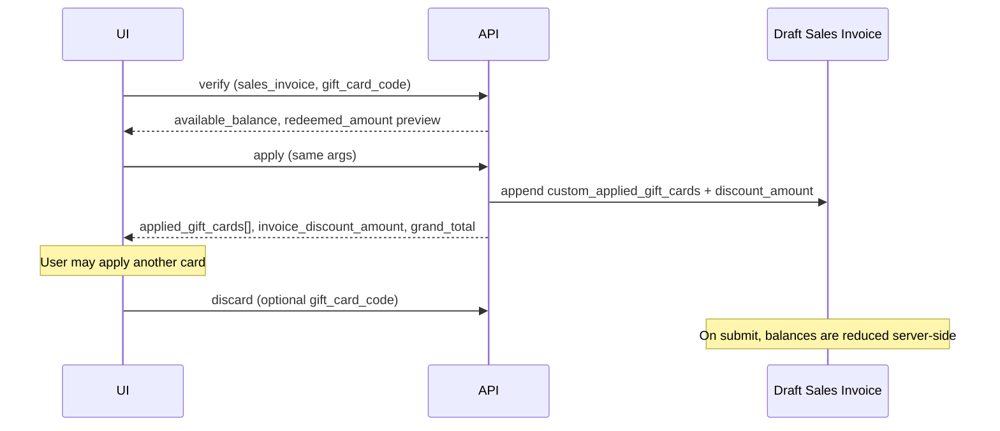

# Gift Cards — Frontend Integration Guide

Guide for frontend / POS developers integrating ArcPOS Gift Cards with the `excel_restaurant_pos` APIs and portal.

**Audience:** Portal (React), Desk clients, or any app calling Frappe whitelisted methods.  
**Backend contract:** Sales Invoice–centric. Coupon Codes of type `Gift Card` hold balance; create/activate happens only on **invoice submit**.

---

## 1. Concepts (read this first)

| Term | Meaning |
|------|---------|
| **Sell** | Cart line is a gift card Item (`custom_is_gift_card_item = 1`). Type **New** (generate code on submit) or **Existing** (activate an Inactive stock code on submit). |
| **Redeem** | Apply one or more Active gift cards to a **draft** Sales Invoice as discount. Balance decreases only when that invoice is **submitted**. |
| **Inactive** | Pre-created stock (bulk/import/admin). Not redeemable until sold. |
| **Active** | Sold/activated; redeemable while balance &gt; 0 and not expired. |

**Hard rules for UI**

1. Do **not** create Coupon Codes in the frontend. Draft only stores line fields + email.
2. Redeem APIs require a **draft Sales Invoice name**. No SI → show “save draft invoice first”.
3. **Promo coupon** and **gift cards** are mutually exclusive. Manual % / flat discount is also exclusive of gift cards at the discount-type level.
4. Multiple gift cards on one invoice are allowed; each takes remaining due.
5. Selling a gift card and redeeming a *different* gift card on the same invoice is allowed.

---

## 2. Calling conventions

All gift routes are whitelisted overrides:

```text
api.gift_cards.*
```

### Portal (`frappe-react-sdk`)

```ts
import { useFrappePostCall } from "frappe-react-sdk";

const { call: verifyGift } = useFrappePostCall("api.gift_cards.verify");
const res = await verifyGift({
  sales_invoice: "ACC-SINV-2026-00001",
  gift_card_code: "GIFT26ABCD",
});
const payload = res.message; // always use .message
```

### Desk / raw Frappe

```js
frappe.call({
  method: "api.gift_cards.apply",
  args: {
    sales_invoice: frm.doc.name,
    gift_card_code: code,
  },
  callback: (r) => console.log(r.message),
});
```

### HTTP

```http
POST /api/method/api.gift_cards.verify
Content-Type: application/json

{
  "sales_invoice": "ACC-SINV-2026-00001",
  "gift_card_code": "GIFT26ABCD"
}
```

Args may also be nested under `data` (JSON string) — same as other ArcPOS APIs.

### Access

`api.gift_cards.verify` is **public** (`allow_guest`), matching
`api.coupons.validate`, so an online-order customer can check a card before
checkout without signing in. `sales_invoice` stays optional and, when given, must
still be a draft.

Every other gift card route — `apply`, `discard`, `list`, `list_inactive`,
`generate_bulk`, `import` — remains authenticated.

Because a gift card is a bearer instrument, the public checker is throttled to
**20 requests per minute per caller** (per IP for guests, per user once signed
in). Over that it returns `Too many requests. Please try again later.` as a
`ValidationError`. Verify on submit or on blur, not on every keystroke.

---

## 3. Feature A — Sell gift cards

### 3.1 Detect a gift card Item

Item APIs expose:

| Field | Type | Use |
|-------|------|-----|
| `custom_is_gift_card_item` | `0 \| 1` | Show gift UI when `1` |
| `custom_gift_card_value` | number | Face value for type **New** |

Sources:

- `excel_restaurant_pos.api.item.get_single_food_item_details`
- `excel_restaurant_pos.api.item.get_food_item_list`

### 3.2 Cart / line fields (required on submit)

When adding to cart or building invoice items, send:

```ts
type GiftCardLine = {
  item_code: string;
  qty: number;
  rate: number;
  // Gift-specific:
  custom_is_gift_card_item: 1;
  custom_gift_card_type: "New" | "Existing";
  custom_gift_card_code?: string; // required if Existing → Coupon Code name
  custom_gift_amount: number;     // face value (New: from Item; Existing: from coupon)
};
```

Invoice header (optional but recommended when selling):

```ts
{
  custom_gift_cards_for: "customer@email.com" // stamped on coupons at submit
}
```

### 3.3 UX for New vs Existing

| Type | UI | Amount |
|------|----|--------|
| **New** | No code picker | Read-only face value = `custom_gift_card_value` |
| **Existing** | Search **and** scan Inactive codes | From selected coupon `custom_discount_amount` |

**Existing picker API**

```ts
await call("api.gift_cards.list_inactive", {
  search: "GIFT26", // code / barcode / QR paste
  limit: 20,
});
// message: { status: "success", data: [{ name, coupon_code, custom_discount_amount, ... }] }
```

- Exact match on `coupon_code`, `name`, `custom_barcode`, `custom_qr_code` is supported (scanners).
- On Enter after a scan, select the single result automatically.

### 3.4 Where to send the payload

| Surface | How |
|---------|-----|
| **Sales Invoice API** | `add_or_update_invoice` / update handlers — pass item gift fields + `custom_gift_cards_for` |
| **Admin POS (Table Order)** | `create_order` `item_list` rows with gift fields + optional `custom_gift_cards_for` on the order |

`api.sales_invoices.add` accepts **every `custom_*` field defined on Sales Invoice Item**,
on create and on update alike — the allowlist is read from the DocType meta, so a gift card
field added to the DocType later works without an API change. Core fields stay restricted to
`item_code`, `qty`, `rate`, `warehouse` and `description`; anything else — core accounting
fields and the `excel_*` accounting dimensions included — is ignored. Keys you omit are left
unset, so nothing is overwritten with `null`.

**Important:** Codes are created/activated only when the **Sales Invoice is submitted**. After submit, read:

```text
Sales Invoice.custom_generated_gift_cards  // "CODE1,CODE2,CODE3"
```

Show these to the cashier (copy-to-clipboard). Reference UI: `CheckoutPopup`, Desk SI alert in `sales_invoice.js`.

### 3.5 Existing portal components

Reuse instead of rewriting:

| Component | Path | Role |
|-----------|------|------|
| `GiftCardSellFields` | `portal/src/components/GiftCard/GiftCardSellFields.tsx` | New/Existing + search/scan |
| `SingleItemModal` | wired for gift sell → cart | |
| `Pos.tsx` | maps gift fields into `create_order` | |

---

## 4. Feature B — Redeem gift cards (checkout)

### 4.1 Prerequisites

- Draft Sales Invoice name available.
- No promotional coupon on the invoice (`custom_coupon_code` empty / promo discarded).
- Order channel allowed in ArcPOS Settings (backend validates).

### 4.2 API flow



### 4.3 Endpoints

#### Verify (preview only)

```ts
POST api.gift_cards.verify
{
  sales_invoice: string;      // required
  gift_card_code: string;     // or coupon_code
}
```

Typical success (`message`):

```json
{
  "status": "success",
  "valid": true,
  "sales_invoice": "ACC-SINV-...",
  "gift_card_code": "GIFT26ABCD",
  "available_balance": 1000,
  "redeemed_amount": 450,
  "already_applied_total": 0
}
```

#### Apply

```ts
POST api.gift_cards.apply
{
  sales_invoice: string;
  // any of these:
  gift_card_code?: string;           // one code, or "A,B,C" / newlines
  gift_card_codes?: string[];        // preferred for multi
  coupon_code?: string;
  coupon_codes?: string[];
}
```

Codes are applied **in order (first → last)**. Each takes remaining due. When the invoice is fully covered, later codes are **skipped** (returned in `skipped`, not an error).

Success includes:

```json
{
  "status": "success",
  "applied": true,
  "newly_applied": [
    { "gift_card_code": "GIFT-A", "redeemed_amount": 1000 },
    { "gift_card_code": "GIFT-B", "redeemed_amount": 200 }
  ],
  "skipped": [
    { "gift_card_code": "GIFT-C", "reason": "Invoice already fully covered..." }
  ],
  "applied_gift_cards": [ "...all rows on invoice..." ],
  "invoice_discount_amount": 1200,
  "grand_total": 0,
  "redeemed_amount": 1200
}
```

Single-code callers stay compatible (`gift_card_code: "ONE"`).

Update cart totals from `invoice_discount_amount` / `grand_total`.

#### Discard

```ts
POST api.gift_cards.discard
{
  sales_invoice: string;
  gift_card_code?: string; // omit to remove ALL applied gift cards
}
```

### 4.4 UI checklist

- [ ] Separate **Gift Card** input from **Promo Coupon** input.
- [ ] List applied cards with remove-per-card.
- [ ] Support keyboard/scanner Enter to apply.
- [ ] If promo is active → hide apply or show “remove promo first”.
- [ ] Refresh payable amount after apply/discard.
- [ ] Do not call apply on a submitted invoice (API will throw).

### 4.5 Existing portal component

`portal/src/components/GiftCard/GiftCardRedeemPanel.tsx`

```tsx
<GiftCardRedeemPanel
  salesInvoice={order?.sales_invoice}
  promoCouponActive={discountType === "coupon" && Boolean(coupon)}
  onAppliedChange={(rows, discountTotal) => {
    // sync local discount UI
  }}
/>
```

---

## 5. Feature C — Admin inventory (optional in POS app)

Desk page: **Gift Card Admin** (`/app/gift-card-admin`). Portal can call the same APIs.

| Method | Purpose |
|--------|---------|
| `api.gift_cards.list` | Paginated list + `status` / `search` |
| `api.gift_cards.generate_bulk` | `{ qty, amount, prefix?, linked_email?, valid_upto? }` → Inactive codes |
| `api.gift_cards.import` | `{ csv_text, valid_upto? }` → Inactive codes |

### Expiry at generation

`valid_upto` (alias `expiry_date`) stamps an expiry on the generated cards. It must not be in the past, and it **survives the sale**: activation only falls back to ArcPOS Settings → *Expire After (Days)* for a card that carries no expiry of its own. A card whose expiry has already passed cannot be sold.

### CSV import format

```csv
code,amount,email,expiry
GIFT-001,1000,guest@example.com,2027-12-31
,2000,,
```

Blank `code` → auto-generated from ArcPOS Settings `gift_card_prefix`. A row's `expiry` (aliases `expiry_date`, `valid_upto`) overrides the request-level `valid_upto`.

### List response shape

```json
{
  "status": "success",
  "data": [ { "name", "coupon_code", "custom_status", "custom_discount_amount", "custom_available_balance", "custom_linked_email", ... } ],
  "total": 120,
  "limit": 50,
  "offset": 0
}
```

Statuses: `Inactive` | `Active` | `Used` | `Expired` | `Rejected`.

---

## 6. Post-sale display

After invoice submit (or after Table Order completion when SI is linked):

1. Read `custom_generated_gift_cards` from the Sales Invoice.
2. Split on comma, trim, show list + copy.

```ts
const codes = (invoice.custom_generated_gift_cards || "")
  .split(",")
  .map((c) => c.trim())
  .filter(Boolean);
```

---

## 7. TypeScript reference types

```ts
export type GiftCardType = "New" | "Existing";
export type GiftCardStatus =
  | "Inactive"
  | "Active"
  | "Used"
  | "Expired"
  | "Rejected";

export type GiftCardSellState = {
  custom_is_gift_card_item: number;
  custom_gift_card_type: GiftCardType;
  custom_gift_card_code?: string;
  custom_gift_amount?: number;
};

export type AppliedGiftCard = {
  gift_card_code: string;
  redeemed_amount: number;
};

export type InactiveGiftCardRow = {
  name: string;
  coupon_code?: string;
  custom_discount_amount?: number;
  custom_available_balance?: number;
  custom_status?: GiftCardStatus;
};
```

---

## 8. Error handling

APIs throw Frappe exceptions (`frappe.throw`). In portal SDK, catch and show `e.message` / `e.exception`.

Common messages:

| Situation | Expected |
|-----------|----------|
| Unknown code, or a promo coupon typed into the gift card field | “The entered code is not a valid Gift Card. Please enter a valid Gift Card code.” |
| Unknown code, or a gift card typed into the coupon field (`api.coupons.validate` / `verify` / `apply`) | “The entered code is not a valid Coupon Code. Please enter a valid Coupon Code.” |
| Selling an Inactive card whose expiry already passed | “Gift Card {code} expired on {date} and cannot be sold.” |
| No draft SI | “only allowed on draft Sales Invoices” |
| Promo + gift | Mutual exclusion error |
| Inactive / Used / Expired code on redeem | Invalid / not Active |
| Existing picker on Active code | Not listed by `list_inactive` |
| Missing Item `custom_gift_card_value` (New) | Validation error on save/submit |
| Channel not allowed | Generation / redemption blocked by settings |

---

## 9. Do / Don’t

**Do**

- Pass gift line fields through every cart → order → invoice bridge.
- Capture `custom_gift_cards_for` when selling.
- Use `api.gift_cards.*` for redeem; do **not** use promo `api.coupons.*` for gift cards.
- Support search **and** scan for Existing sell + redeem.

**Don’t**

- Don’t invent Coupon Codes client-side.
- Don’t apply gift cards without a draft Sales Invoice.
- Don’t mix promo coupon UI state with gift card apply.
- Don’t assume Table Order discount alone redeems a gift card — redemption is SI-based.

---

## 10. Quick integration checklist (new screen)

1. [ ] Item detail shows gift sell fields when `custom_is_gift_card_item`.
2. [ ] Cart payload includes gift line fields + optional email.
3. [ ] Checkout has Gift Card redeem panel bound to draft SI.
4. [ ] Promo and gift UI are mutually exclusive.
5. [ ] After paid/submit, show `custom_generated_gift_cards`.
6. [ ] Scanner: Enter / paste into search or redeem field works.

---

## 11. Reference files in this repo

| Area | Path |
|------|------|
| Sell fields UI | `portal/src/components/GiftCard/GiftCardSellFields.tsx` |
| Redeem panel UI | `portal/src/components/GiftCard/GiftCardRedeemPanel.tsx` |
| Admin POS wiring | `portal/src/pages/Admin/Pos/Pos.tsx` |
| Order checkout | `portal/src/pages/orders/SingleOrderModal.tsx` |
| Desk SI helpers | `excel_restaurant_pos/public/js/sales_invoice.js` |
| API routes | `excel_restaurant_pos/api/gift_card/` |
| Desk admin page | `/app/gift-card-admin` |
| Product plan | `docs/gift-card-implementation-plan.md` |

---

## 12. Minimal redeem example

```tsx
const { call: applyGift } = useFrappePostCall("api.gift_cards.apply");

async function onApply(salesInvoice: string, code: string) {
  try {
    const res = await applyGift({
      sales_invoice: salesInvoice,
      gift_card_code: code.trim(),
    });
    const m = res.message;
    setApplied(m.applied_gift_cards || []);
    setPayable(m.grand_total);
  } catch (e: any) {
    toast.error(e?.message || "Could not apply gift card");
  }
}
```

Questions about edge cases (website cart `AllCarts`, creating draft SI earlier for Table Order redeem) should be raised with backend before changing UX assumptions.
