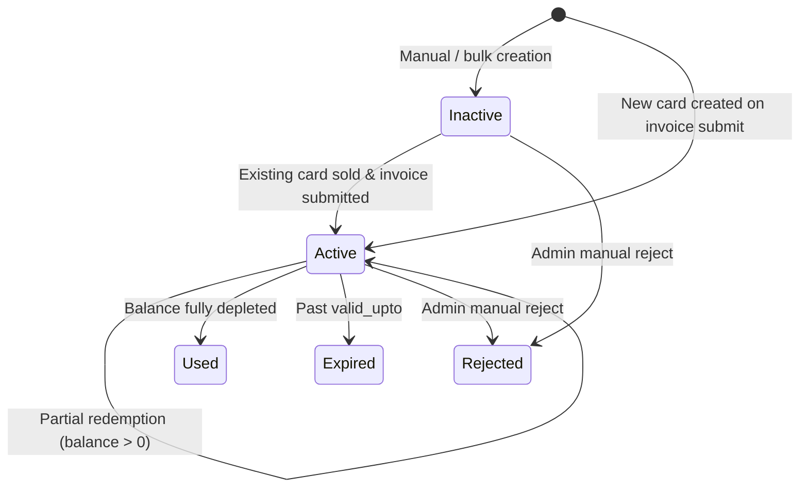
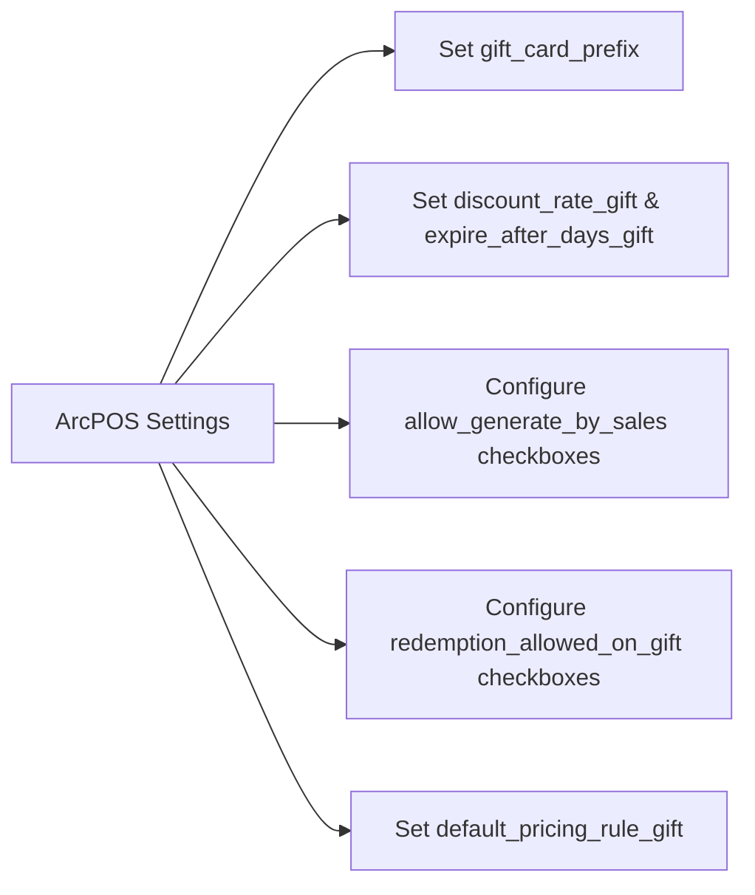
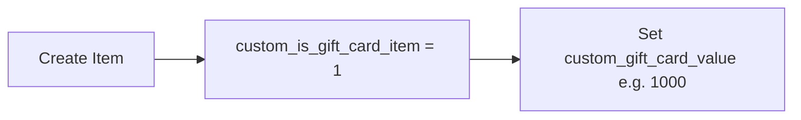
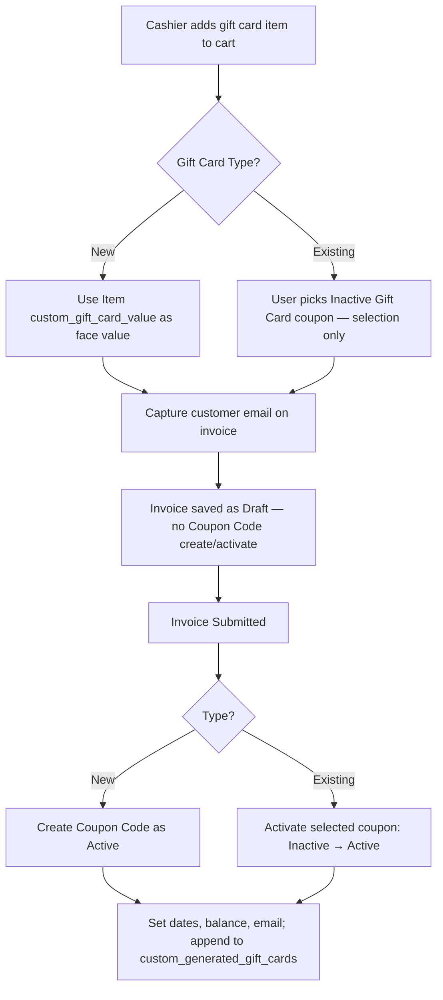

# Gift Card Feature — Implementation Plan

> **Status:** Approved — development in progress  
> **App:** `excel_restaurant_pos` (ArcPOS / ERPNext v14) — **production system**  
> **Date:** 2026-08-27  
> **Note:** Scope is full production delivery. Build order below is sequencing only, not MVP cut lines.

---

## 1. Purpose

This document describes the end-to-end Gift Card workflow for ArcPOS: configuration, selling gift cards as items, lifecycle management of Coupon Code documents, and balance-based redemption on future orders.

It is intended as a **review artifact** before development begins. No backend or frontend gift-card logic exists yet; schema and settings are largely in place.

---

## 2. Scope

### In scope


| Area                   | Description                                                                       |
| ---------------------- | --------------------------------------------------------------------------------- |
| **Selling gift cards** | POS / invoice line items flagged as gift card products (`New` or `Existing` type) |
| **Auto-generation**    | Create Coupon Code documents when a `New` gift card item is sold                  |
| **Pre-created stock**  | Manually / bulk-created inactive gift cards activated when sold as `Existing`     |
| **Lifecycle**          | Create/activate only on invoice **submit** (Inactive → Active for Existing; New created as Active) |
| **Redemption**         | Apply one or more gift cards toward order total; log partial redemptions          |
| **Configuration**      | ArcPOS Settings gift card section                                                 |
| **Email linking**      | Customer email on invoice → coupon `custom_linked_email`                          |


### Explicitly deferred (not part of this gift card delivery unless requested)

- Automatic email delivery of gift card codes to customers
- Gift card refunds / cancellations / chargebacks
- Multi-currency gift cards

Physical QR/barcode **generation** already exists on Coupon Code; **scan-to-select** in POS is in scope for this delivery.

---


## 3. Current State Assessment


### Already implemented (schema & settings)


| Component                                                              | Status           | Location                                    |
| ---------------------------------------------------------------------- | ---------------- | ------------------------------------------- |
| ArcPOS Settings — Gift Card section                                    | ✅ Fields exist   | `arcpos_settings/arcpos_settings.json`      |
| Item — `custom_is_gift_card_item`, `custom_gift_card_value`            | ✅ Custom fields  | `fixtures/custom_field.json`                |
| Sales Invoice — `custom_generated_gift_cards`, `custom_gift_cards_for` | ✅ Custom fields  | `fixtures/custom_field.json`                |
| Sales Invoice Item — gift card line fields                             | ✅ Custom fields  | `fixtures/custom_field.json`                |
| Coupon Code — gift/balance/status fields                               | ✅ Custom fields  | `fixtures/custom_field.json`                |
| Child table — Coupon Redeemed on Orders                                | ✅ DocType exists | `doctype/coupon_redeemed_on_orders/`        |
| Promotional coupon engine                                              | ✅ Fully built    | `shared/coupon/services.py`, `api/coupon/*` |


### Not yet implemented (business logic)


| Component                                                                  | Status |
| -------------------------------------------------------------------------- | ------ |
| Gift card generation on invoice save/submit                                | ❌      |
| Existing gift card activation on sale                                      | ❌      |
| Balance computation (`custom_available_balance`)                           | ❌      |
| Partial redemption logging in child table                                  | ❌      |
| Gift-card-specific redemption validation                                   | ❌      |
| Order-type gates (`allow_generate_by_sales`, `redemption_allowed_on_gift`) | ❌      |
| POS / Portal UI for gift card item selection                               | ❌      |
| Gift card–specific API endpoints                                           | ❌      |


### Schema notes / minor gaps to resolve during dev

1. `Sales Invoice Item.custom_gift_amount` stays **Data** in fixtures (production already has varchar values). Changing to Currency mid-migrate truncates existing rows (`Data truncated for column 'custom_gift_amount'`). App code uses `flt()` so numeric behavior is fine. A dedicated cleanup patch can convert later if needed.
2. **Child table link field** is named `sales_invoice` in the DocType; spec references `invoice_no`. Same concept — use existing field name.
3. `Coupon Code.custom_order_status` is a Float with precision 0. For gift cards set to `1` on submit when created/activated. Draft invoices do not touch coupons, so `0` is unused for this flow.
4. **Status vocabulary:** fixtures include `Pending`, `Active`, `Inactive`, `Used`, `Expired`, `Rejected`. Gift cards use **Inactive / Active / Used / Expired / Rejected** only — **Pending is not used** (no draft-time creation).

---


## 4. Data Model Reference


### 4.1 ArcPOS Settings (Single DocType)


| Field                         | Type                | Purpose                                                                             |
| ----------------------------- | ------------------- | ----------------------------------------------------------------------------------- |
| `gift_card_prefix`            | Data                | Code template, e.g. `GIFT26-####` → `GIFT26A1B1`                                    |
| `default_pricing_rule_gift`   | Link → Pricing Rule | Required ERPNext field; no discount impact                                          |
| `discount_type_gift`          | Select              | Fixed to `Flat Amount`                                                              |
| `discount_rate_gift`          | Currency            | Default face value for auto-generated cards (overridden by item value when selling) |
| `expire_after_days_gift`      | Int                 | Validity window from activation date                                                |
| `no_by_sales`                 | Check               | When checked, **disables** all auto-generation from invoice                         |
| `dine_in_by_sales`            | Check               | Allow generation on Dine-in / Table-Takeout orders                                  |
| `in_store_pickup_by_sales`    | Check               | Allow generation on In Store / Pickup                                               |
| `online_delivery_by_sales`    | Check               | Allow generation on Website / Delivery                                              |
| `online_pickup_by_sales`      | Check               | Allow generation on Website / Pickup                                                |
| `dine_in_gift_redeem`         | Check               | Allow redemption on Dine-in channel                                                 |
| `in_store_pickup_gift_redeem` | Check               | Allow redemption on In Store Pickup                                                 |
| `online_delivery_gift_redeem` | Check               | Allow redemption on Online Delivery                                                 |
| `online_pickup_gift_redeem`   | Check               | Allow redemption on Online Pickup                                                   |


**Generation rule:** If `no_by_sales` is checked → never auto-generate. Otherwise, the invoice's order channel must match at least one checked `*_by_sales` flag.

**Redemption rule:** Invoice order channel must match at least one checked `*_gift_redeem` flag.

### 4.2 Coupon Code (extended for Gift Card)


| Field                              | Notes                                                           |
| ---------------------------------- | --------------------------------------------------------------- |
| `coupon_name` / `coupon_code`      | Unique code string                                              |
| `coupon_type`                      | Always `Gift Card` for this feature                             |
| `valid_from`                       | Set on **submit** (order submission date) when card is created/activated |
| `valid_upto`                       | `valid_from + expire_after_days_gift`                                    |
| `custom_discount_type`             | `Flat Amount` (from settings or item)                                    |
| `custom_discount_amount`           | Face value / original balance                                            |
| `custom_available_balance`         | `custom_discount_amount − SUM(redeemed_amount)` — recomputed             |
| `custom_created_on`                | Datetime of Coupon Code creation                                         |
| `custom_linked_email`              | Customer email from selling invoice                                      |
| `custom_status`                    | Lifecycle status (see §6)                                                |
| `custom_order_status`              | Set to `1` on submit when sold/activated                                 |
| `custom_generated_on_order`        | Link to Sales Invoice that sold/activated this card                      |
| `custom_coupon_redeemed_on_orders` | Child table redemption log                                      |
| `pricing_rule`                     | From `default_pricing_rule_gift`                                |


**Child table — Coupon Redeemed on Orders**


| Field             | Type                 |
| ----------------- | -------------------- |
| `sales_invoice`   | Link → Sales Invoice |
| `redeemed_amount` | Currency             |


### 4.3 Item


| Field                      | Purpose                                        |
| -------------------------- | ---------------------------------------------- |
| `custom_is_gift_card_item` | Marks sellable gift card SKU                   |
| `custom_gift_card_value`   | Face value when type = `New` (e.g. 1000, 2000) |


### 4.4 Sales Invoice


| Field                         | Purpose                                                                  |
| ----------------------------- | ------------------------------------------------------------------------ |
| `custom_generated_gift_cards` | Comma-separated codes generated/activated in this sale                   |
| `custom_gift_cards_for`       | Customer email for gift cards on this invoice                            |
| `custom_coupon_code`          | *(existing)* Single promo coupon for **promotional** redemption only     |
| `custom_applied_gift_cards`   | **(New)** Child table of gift cards applied for redemption on this order |


**Child table — Applied Gift Cards** (new, on Sales Invoice)


| Field             | Type                 | Purpose                                      |
| ----------------- | -------------------- | -------------------------------------------- |
| `gift_card_code`  | Link → Coupon Code   | Gift card being redeemed                     |
| `redeemed_amount` | Currency             | Amount applied from this card to this invoice |


Invoice-level `discount_amount` (gift card path) = **SUM(`redeemed_amount`)** across all applied gift card rows.


### 4.5 Sales Invoice Item


| Field                      | Purpose                                                 |
| -------------------------- | ------------------------------------------------------- |
| `custom_is_gift_card_item` | Fetched from Item                                       |
| `custom_gift_card_type`    | `New` or `Existing`                                     |
| `custom_gift_card_code`    | Link → Coupon Code (when `Existing`)                    |
| `custom_coupon_value`      | Fetched from selected coupon's `custom_discount_amount` |
| `custom_gift_amount`       | Line gift value: from Item (New) or Coupon (Existing)   |


---


## 5. Order Channel Mapping

Reuse the channel model from `shared/coupon/services.py`:


| Setting label   | `custom_order_from` | `custom_service_type`  |
| --------------- | ------------------- | ---------------------- |
| Dine-in         | `Table`             | `Dine-in` or `Takeout` |
| In Store Pickup | `In Store`          | `Pickup`               |
| Online Delivery | `Website`           | `Delivery`             |
| Online Pickup   | `Website`           | `Pickup`               |


Helper functions will mirror `is_channel_allowed()` but read ArcPOS Settings gift-card checkbox fields instead of promotional coupon select fields.

---


## 6. Gift Card Lifecycle States

**Design decision (confirmed):** Coupon Codes are **not** created or activated while the Sales Invoice is Draft. Draft is cart/order staging only — line fields (`custom_gift_card_type`, `custom_gift_card_code`, email) may be stored on the invoice, but they do not mutate Coupon Code documents until **submit**.

Therefore there is no draft-delete / draft-cancel cleanup for gift cards.



| Status       | When set                                                     | Redeemable?                                |
| ------------ | ------------------------------------------------------------ | ------------------------------------------ |
| **Inactive** | Manual/bulk Coupon Code creation (`coupon_type = Gift Card`) | No — must be sold first                    |
| **Active**   | Invoice **submitted** (New created Active, or Existing activated) | Yes, if balance > 0 and not expired   |
| **Used**     | `custom_available_balance <= 0`                              | No                                         |
| **Expired**  | `today > valid_upto` (daily scheduler, same as coupons)      | No                                         |
| **Rejected** | Manual admin action                                          | No (terminal, same as promotional coupons) |

**Submit-time side effects (create New or activate Existing):**

- `custom_status` → `Active`
- `custom_order_status` → `1`
- `valid_from` → invoice `posting_date` (order submission date)
- `valid_upto` → `valid_from + expire_after_days_gift`
- `custom_linked_email` ← `custom_gift_cards_for` on invoice (if set)
- `custom_available_balance` ← `custom_discount_amount` (initial full balance)
- Codes written to `custom_generated_gift_cards`

---


## 7. End-to-End Workflows


### 7.1 Configuration setup




**Admin checklist:**

- [ ] Define prefix (e.g. `GIFT26-####`)
- [ ] Set default flat amount and expiry days
- [ ] Choose order types that may **sell/generate** gift cards
- [ ] Choose order types that may **redeem** gift cards
- [ ] Ensure Pricing Rule exists and is linked

---


### 7.2 Item master setup




One Item per denomination is typical (Gift Card $50, Gift Card $100, etc.).

---


### 7.3 Selling a gift card — overview




---


### 7.4 Flow A — Sell **New** gift card


| Step | Actor   | Action                      | System behavior                                                                         |
| ---- | ------- | --------------------------- | --------------------------------------------------------------------------------------- |
| 1    | Cashier | Adds gift card Item to cart | Sets `custom_is_gift_card_item=1`, default `custom_gift_card_type=New`                  |
| 2    | Cashier | Confirms type = **New**     | `custom_gift_amount` ← Item.`custom_gift_card_value`                                    |
| 3    | Cashier | Enters customer email       | `Sales Invoice.custom_gift_cards_for` populated                                         |
| 4    | System  | Invoice saved (Draft)       | **No Coupon Code created** — only line/email fields stored on the invoice               |
| 5    | System  | Invoice **Submitted**       | If channel allowed → create Coupon Code(s) as **Active** (§6)                           |
| 5a   |         |                             | `coupon_type = Gift Card`; code from `gift_card_prefix`                                 |
| 5b   |         |                             | `custom_discount_amount` = line `custom_gift_amount` (item value)                       |
| 5c   |         |                             | `custom_status = Active`, `custom_order_status = 1`, dates + balance set                |
| 5d   |         |                             | `custom_generated_on_order` = invoice name; append to `custom_generated_gift_cards`     |
| 5e   |         |                             | `custom_linked_email` from `custom_gift_cards_for`                                      |


**Quantity > 1:** Each unit generates a **distinct** coupon code at submit time.

---


### 7.5 Flow B — Sell **Existing** (pre-created) gift card

Pre-created cards are made manually (single or bulk) with:

- `coupon_type = Gift Card`
- `custom_discount_type = Flat Amount`
- `custom_discount_amount` = face value
- `custom_status = Inactive`


| Step | Actor   | Action                                   | System behavior                                        |
| ---- | ------- | ---------------------------------------- | ------------------------------------------------------ |
| 1    | Admin   | Creates Coupon Code(s) manually          | Status = **Inactive**                                  |
| 2    | Cashier | Adds gift card Item, type = **Existing** | Prompt to select coupon                                |
| 3    | Cashier | Selects `custom_gift_card_code`          | Must be Inactive, type Gift Card                       |
| 4    | System  |                                          | `custom_gift_amount` ← coupon `custom_discount_amount` |
| 5    | Cashier | Enters email                             | `custom_gift_cards_for`                                |
| 6    | System  | Draft save                               | Store selection on invoice line only; **coupon stays Inactive** (no lock / no status change) |
| 7    | System  | Submit                                   | Activate selected coupon; `valid_from` = submit date   |
| 8    | System  |                                          | Append code to `custom_generated_gift_cards`           |

**Draft cancel / delete:** No coupon cleanup needed. The Existing card was never activated, so it remains **Inactive** and selectable on another order.

**Validation on Existing selection (draft) and again on submit:**

- Coupon exists, `coupon_type == Gift Card`
- `custom_status == Inactive`
- On submit: still Inactive (reject if another invoice already activated it)

---


### 7.6 Flow C — Redeem gift card(s) on an order

Gift card redemption is **balance-based** and supports **multiple gift cards on one invoice**.

**Discount mechanism rule (confirmed):**

| Allowed | Not allowed |
|---------|-------------|
| One promo coupon **or** one/more gift cards **or** manual discount | Mixing promo coupon + gift card(s) on the same invoice |
| Multiple gift cards on the same invoice | — |

Promotional coupons keep using single field `custom_coupon_code`. Gift card redemptions use child table `custom_applied_gift_cards`.

```mermaid
sequenceDiagram
    participant Cashier
    participant POS
    participant API
    participant Coupon as Coupon Code(s)
    participant SI as Sales Invoice

    Cashier->>POS: Enter gift card code #1
    POS->>API: verify/apply gift card
    API->>Coupon: Validate Active, balance, channel
    API->>SI: Add row to custom_applied_gift_cards
    Note over SI: discount = SUM(redeemed amounts)

    Cashier->>POS: Enter gift card code #2 (optional)
    POS->>API: verify/apply gift card
    API->>SI: Add another row; remaining due shrinks

    Cashier->>POS: Submit invoice
    API->>Coupon: For each applied card: append redemption log
    API->>Coupon: Recompute each custom_available_balance
    API->>Coupon: Set Used where balance = 0
```

| Step | Validation / action |
| ---- | ------------------- |
| 1 | Order channel ∈ `redemption_allowed_on_gift` |
| 2 | Coupon `coupon_type == Gift Card` |
| 3 | `custom_status == Active` |
| 4 | Not expired (`posting_date <= valid_upto`) |
| 5 | `custom_available_balance > 0` |
| 6 | Cannot redeem a card on the **same** invoice that **sold** it |
| 7 | Cannot apply the same gift card twice on one invoice |
| 8 | Cannot apply gift cards if a promo coupon / conflicting manual discount is already set |
| 9 | Per card: `redeemed_amount = MIN(card.available_balance, remaining_invoice_due)` |
| 10 | Invoice `discount_amount = SUM(all applied gift card redeemed_amounts)` |
| 11 | On submit: for each applied row, append `{sales_invoice, redeemed_amount}` on that Coupon Code |
| 12 | Recompute each balance; set **Used** when balance ≤ 0 |

**Multi-card example:**

| | Amount |
|--|--------|
| Order total | 1500 |
| Gift card A balance | 1000 → redeem **1000** |
| Gift card B balance | 800 → redeem **500** (remaining due) |
| Customer pays | 0 |
| A after submit | balance 0 → **Used** |
| B after submit | balance 300 → stays **Active** |

**Single-card partial example:**

- Card balance: 1000, Order total: 600 → redeem 600, balance 400, stays **Active**

---


### 7.7 Email mapping

Priority for `custom_linked_email` on gift card Coupon Code:

1. `Sales Invoice.custom_gift_cards_for` (explicit on sale)
2. Customer primary email (from Contact / Customer.email_id)
3. `Sales Invoice.custom_email_address` (if present)

On **sale submit**, write email to all coupons generated/activated in that invoice.

On **redemption**, optionally update linked email if empty (confirm during review).

---


## 8. Integration with Existing Coupon System

The promotional coupon engine (`shared/coupon/services.py`) and gift cards share the Coupon Code DocType but differ materially:


| Aspect              | Promotional coupon                           | Gift card                              |
| ------------------- | -------------------------------------------- | -------------------------------------- |
| Trigger             | Subtotal threshold + channel                 | Gift card item on invoice              |
| Generation settings | `allow_auto_generate_cc`, `auto_generate_on` | `allow_generate_by_sales` checkboxes   |
| Value source        | ArcPOS discount_rate                         | Item value or pre-created coupon       |
| Redemption          | Full % or flat via `maximum_use` counter     | Partial balance; **multiple cards** per invoice via SI child table |
| Status on create    | Active                                       | Active on submit (New); Inactive until sold (manual Existing) |
| Apply storage       | `custom_coupon_code` (single)                | `custom_applied_gift_cards` (child table, many) |


**Design decision:** Implement gift card logic in a **separate module** (`shared/gift_card/`) that:

- Hooks into the same Sales Invoice events
- Delegates shared utilities (code generation, channel matching, email resolution) to `shared/coupon/`
- Branches in apply/verify paths when `coupon_type == Gift Card`

This avoids breaking the existing promotional coupon tests and behavior.

---


## 9. Backend Implementation Plan


### 9.1 New module structure

```
excel_restaurant_pos/shared/gift_card/
├── __init__.py
├── services.py          # Core generation, activation, balance, redemption
├── validation.py        # Order-type gates, existing-card checks
└── test_gift_card_services.py

excel_restaurant_pos/api/gift_card/
├── __init__.py
├── verify_gift_card.py
├── apply_gift_card.py
├── discard_gift_card.py
├── list_inactive.py     # For Existing-type picker
└── generate_bulk.py     # Bulk inactive creation (admin)
```


### 9.2 Document hooks (Sales Invoice)


| Event           | Handler                         | Responsibility                                                          |
| --------------- | ------------------------------- | ----------------------------------------------------------------------- |
| `validate`      | `validate_gift_card_lines`      | Existing code still Inactive; amounts consistent (draft-safe checks)    |
| `validate`      | `validate_gift_card_redemption` | Channel + balance for each row in `custom_applied_gift_cards`           |
| `before_submit` | `process_gift_cards_on_submit`  | Create New coupons / activate Existing; set Active, dates, balance      |
| `on_submit`     | `finalize_gift_card_links`      | Write `custom_generated_gift_cards`, email links                        |
| `on_submit`     | `record_gift_card_redemption`   | For each applied gift card: log child row; update balance               |


Register in `doc_event/__init__.py` alongside existing coupon hooks. Order matters: gift card redemption should run in coordination with `apply_sales_invoice_coupon_discount` — gift cards take precedence when `coupon_type == Gift Card`.

### 9.3 Key functions (pseudocode)

```python
def is_gift_card_generation_allowed(invoice, settings) -> bool:
    if settings.no_by_sales:
        return False
    channel = resolve_channel(invoice)
    return channel_matches_generation_flags(channel, settings)

def create_gift_card_coupon(invoice, line, settings) -> CouponCode:
    """Called only on invoice submit for type=New. Created already Active."""
    amount = line.custom_gift_amount or line.item.custom_gift_card_value
    code = generate_unique_coupon_code(settings.gift_card_prefix)
    return CouponCode(
        coupon_type="Gift Card",
        custom_discount_amount=amount,
        custom_status="Active",
        custom_order_status=1,
        custom_generated_on_order=invoice.name,
        valid_from=invoice.posting_date,
        valid_upto=add_days(invoice.posting_date, settings.expire_after_days_gift),
        custom_available_balance=amount,
        custom_linked_email=get_gift_card_email(invoice),
        ...
    )

def activate_existing_gift_card_coupon(coupon, invoice, settings):
    """Called only on invoice submit for type=Existing."""
    coupon.custom_status = "Active"
    coupon.custom_order_status = 1
    coupon.valid_from = invoice.posting_date
    coupon.valid_upto = add_days(coupon.valid_from, settings.expire_after_days_gift)
    coupon.custom_available_balance = coupon.custom_discount_amount
    coupon.custom_linked_email = get_gift_card_email(invoice)
    coupon.custom_generated_on_order = invoice.name

def recompute_available_balance(coupon):
    redeemed = sum(row.redeemed_amount for row in coupon.custom_coupon_redeemed_on_orders)
    coupon.custom_available_balance = coupon.custom_discount_amount - redeemed
    if coupon.custom_available_balance <= 0:
        coupon.custom_status = "Used"
```


### 9.4 API endpoints


| Route                           | Method | Purpose                                               |
| ------------------------------- | ------ | ----------------------------------------------------- |
| `api.gift_cards.verify`         | POST   | Validate code + preview amount given already-applied cards |
| `api.gift_cards.apply`          | POST   | Append gift card to draft invoice applied list        |
| `api.gift_cards.discard`        | POST   | Remove one (or all) applied gift card(s) from draft   |
| `api.gift_cards.list_inactive`  | GET    | Search inactive gift cards for Existing picker        |
| `api.gift_cards.get_by_invoice` | GET    | List codes generated on an invoice                    |
| `api.gift_cards.list`           | GET    | Admin list (filters: status, email, dates, balance)   |
| `api.gift_cards.generate_bulk`  | POST   | Create N Inactive gift cards (qty, amount, expiry)    |
| `api.gift_cards.import`         | POST   | Import CSV/Excel rows into Inactive gift cards        |


Wire into `api/__init__.py` following the existing `api.coupons.*` pattern.

### 9.5 Scheduled tasks

Extend daily `expire_coupon_codes` (or gift-card-specific task) to expire **Active** gift cards past `valid_upto`. Reuse `refresh_coupon_status()` with gift-card-aware balance logic.

### 9.6 Desk (ERPNext form) scripts

Optional `public/js/sales_invoice.js` additions:

- Auto-set `custom_gift_amount` when gift card type / code changes
- Filter `custom_gift_card_code` link query: `coupon_type=Gift Card`, `custom_status=Inactive`
- Sync `custom_gift_cards_for` from customer email

---


## 10. Frontend (POS / Portal) Implementation Plan

No gift card UI exists in `portal/src` today. Coupon discount UI exists in `Pos.tsx`, `AllCarts.tsx`, `SingleOrderModal.tsx`.

### 10.1 Cart — selling gift cards

When item has `custom_is_gift_card_item`:

1. Show **Gift Card Type** selector: `New` | `Existing`
2. If **Existing**: search/list **or** scan QR/barcode → resolve Inactive gift card
3. Display **Gift Amount** (read-only, from item or coupon)
4. Prompt for **recipient email** at cart or checkout → maps to `custom_gift_cards_for`

Payload to `add_or_update_invoice` must include per-line:

```json
{
  "item_code": "GIFT-CARD-1000",
  "custom_is_gift_card_item": 1,
  "custom_gift_card_type": "New",
  "custom_gift_card_code": null,
  "custom_gift_amount": 1000
}
```


### 10.2 Checkout — redeeming gift cards

Dedicated **Gift Card** redemption UI (separate from Promo Code):

- Allow adding **multiple** gift card codes one by one
- After each apply, show list of applied cards + amounts + remaining due
- Call `api.gift_cards.verify` / `apply` / `discard` (discard by code or clear all)
- Block applying a gift card if a promo coupon is already on the invoice (and vice versa)
- On submit, backend records redemption for every applied row

**UX recommendation:** Separate "Promo Code" and "Gift Card" inputs. Gift Card UI supports a list; Promo Code stays single.

### 10.3 Post-sale display

After submit, show generated codes from `custom_generated_gift_cards` (comma-separated) with copy-to-clipboard.

---


## 11. Business Rules Summary


| #   | Rule                                                                          |
| --- | ----------------------------------------------------------------------------- |
| R1  | Only items with `custom_is_gift_card_item=1` trigger gift card flows          |
| R2  | If `no_by_sales` checked, no auto-generation on any invoice                   |
| R3  | New cards: one unique Coupon Code per unit sold                               |
| R4  | Existing cards: must be Inactive before sale; become Active on submit         |
| R5  | Draft invoices never create or activate Coupon Codes                          |
| R6  | Redemption per card cannot exceed that card's balance; total gift discount cannot exceed order total |
| R7  | Redemption must pass `redemption_allowed_on_gift` channel check               |
| R8  | Cannot redeem a gift card on the invoice that generated/sold it               |
| R8b | Multiple gift cards allowed on one invoice; same code cannot be applied twice |
| R8c | Gift card redemption and promo coupon are mutually exclusive on one invoice   |
| R9  | `custom_available_balance = custom_discount_amount − SUM(redeemed_amount)`    |
| R10 | Balance 0 → status **Used**; past expiry → **Expired**                        |
| R11 | `valid_from` / `valid_upto` set only on submit                                |
| R12 | For Existing manual cards, `valid_from` at activation = Order Submission Date |


---


## 12. Edge Cases & Open Questions

Please confirm the following before development:


| #   | Question                                                                                   | Proposed default                                                 |
| --- | ------------------------------------------------------------------------------------------ | ---------------------------------------------------------------- |
| Q1  | ~~Draft invoice deleted — Pending coupons?~~                                               | **N/A** — no create/activate on draft                            |
| Q2  | ~~Draft cancelled after Existing selected — release to Inactive?~~                         | **N/A** — Existing stays Inactive until submit; nothing to release |
| Q3  | Multiple gift card **items sold** on one invoice — how to store generated codes? | **Comma-separated** in `custom_generated_gift_cards` (confirmed) |
| Q4  | Can one invoice both **sell** a gift card and **redeem** a different gift card?            | **Yes** (confirmed)                                                  |
| Q5  | Item missing `custom_gift_card_value`?                                                     | **Throw validation error** (confirmed)                               |
| Q6  | Mixed cart: gift card item + normal items — generation still per gift line?                | **Yes** (default)                                                    |
| Q7  | Update `custom_linked_email` on redemption if already set?                                 | **No — keep original purchaser email** (confirmed)                   |
| Q8  | Gift card(s) with promo coupon / manual discount on same invoice?              | Mutually exclusive discount **type**; **multiple gift cards OK**         |
| Q9  | Bulk manual creation UI?                                                                   | **Dedicated page** + list + import + bulk creation API (confirmed)   |
| Q10 | Existing gift card picker: search vs QR/barcode scan?                                      | **Both required** — search/list and scan (confirmed)                 |


**Q3 explained (selling, not redeeming):**  
If one order sells 3 New gift cards, the system creates 3 codes (e.g. `GIFT26A1`, `GIFT26B2`, `GIFT26C3`). Those codes are stored on the Sales Invoice in `custom_generated_gift_cards` as one comma-separated string: `GIFT26A1,GIFT26B2,GIFT26C3`. That matches the existing field design.

**Q9 — Bulk admin UI (confirmed scope):**

| Piece | Detail |
|-------|--------|
| Dedicated page | ArcPOS admin page for gift card inventory (not ArcPOS Settings, not only standard Coupon Code list) |
| List | Filterable list of gift cards (status, balance, email, dates, linked invoice) |
| Import | Upload CSV/Excel to create many Inactive gift cards at once |
| Bulk creation API | `api.gift_cards.generate_bulk` — qty, face value, expiry, optional email prefix rules |

**Q10 — Existing picker (confirmed):**  
Cashier can pick an Inactive gift card by **search/list** and by **QR/barcode scan**. Coupon Code already has `custom_qr_code` / `custom_barcode` fields to scan against. Both are required for production delivery.


---


## 13. Implementation Order

This is a **production** ArcPOS feature. The list below is build order for safe delivery and testing — not an MVP vs later split. All listed workstreams are in scope for the same production release unless explicitly deferred in §2.

### Workstream A — Backend sell flow

- [x] Gift card service module (generate, activate, balance)
- [x] Sales Invoice hooks for sell flows (New + Existing) — submit-only
- [x] Channel validation helpers for generation & redemption
- [x] Unit tests for lifecycle and balance math
- [x] Applied Gift Cards child DocType + SI table field
- [ ] ~~Fix `custom_gift_amount` fieldtype → Currency~~ **Deferred** — keep Data; Currency alter fails on existing varchar data in prod

### Workstream B — Redemption (including multi-card)

- [x] Gift card verify/apply/discard API (multi-card child table)
- [x] Submit-time redemption logging
- [x] Integration with invoice discount application
- [x] Mutual exclusion with promo coupon
- [x] list_inactive + admin list APIs
- [x] Unit tests for redemption allocation / exclusion
- [x] Expiry scheduler — reuses daily `expire_coupon_codes` (Active gift cards included)

### Workstream C — POS / Portal UI

- [x] Gift card line item UX (type, existing picker, amount)
- [x] Existing picker: search/list **and** QR/barcode scan
- [x] Email capture → `custom_gift_cards_for`
- [x] Gift card redemption UI (multi-card list)
- [x] Post-sale generated codes display

### Workstream D — Admin inventory

- [x] Dedicated Gift Card admin page (list + filters)
- [x] Bulk create form (qty × face value → Inactive codes)
- [x] CSV/Excel import into Inactive gift cards
- [x] Wire `api.gift_cards.list` / `generate_bulk` / `import`
- [x] Sales Invoice desk form helpers
- [x] Reports: outstanding liability, redemption history

**Constraint:** Do not ship sell/redeem to production without Workstreams A–C. Admin bulk tools (D) should ship with the same release so Existing inventory can be stocked safely.

---


## 14. Test Plan (acceptance)


### Configuration

- [ ] Prefix generates unique codes matching template
- [ ] `no_by_sales` blocks all generation
- [ ] Each order-type checkbox correctly gates generation


### Selling — New

- [ ] Draft save does **not** create a Coupon Code
- [ ] Submit creates Active coupon with correct amount, dates, balance
- [ ] Email mapped to coupon
- [ ] Codes appear in `custom_generated_gift_cards`
- [ ] qty=3 produces 3 distinct codes
- [ ] Deleting a draft invoice leaves no orphan gift card coupons


### Selling — Existing

- [ ] Inactive coupon selectable in POS
- [ ] Active/Used/Expired coupons rejected in picker
- [ ] Draft selection does **not** change coupon status (stays Inactive)
- [ ] Cancelling/deleting draft leaves Existing coupon Inactive and reusable
- [ ] Submit activates with submission-date validity
- [ ] No duplicate code generated


### Redemption

- [ ] Active card with balance redeems up to order total
- [ ] Partial redemption leaves correct balance
- [ ] Full redemption sets Used
- [ ] **Multiple gift cards** on one invoice: amounts allocated until due is covered
- [ ] Second card only takes remaining due after first
- [ ] Same gift card cannot be applied twice on one invoice
- [ ] Promo coupon + gift card blocked together
- [ ] Expired card rejected
- [ ] Wrong order channel rejected
- [ ] Cannot redeem on same invoice that sold the card
- [ ] Child table rows on each Coupon Code match submitted invoice amounts


### Regression

- [ ] Promotional coupon flows unchanged
- [ ] Existing coupon API tests pass

---


## 15. File Touch List (estimated)


| File                                           | Change                                       |
| ---------------------------------------------- | -------------------------------------------- |
| `shared/gift_card/*`                           | **New** — core logic                         |
| `api/gift_card/*`                              | **New** — REST endpoints                     |
| `doc_event/__init__.py`                        | Register gift card hooks                     |
| `hooks.py`                                     | API routes                                   |
| `excel_restaurant_pos/.../applied_gift_cards/` | **New** child DocType for multi gift-card redemption |
| `fixtures/custom_field.json`                   | Add SI `custom_applied_gift_cards`; fix gift amount type |
| `public/js/sales_invoice.js`                   | Desk form helpers                            |
| `portal/src/pages/Admin/Pos/Pos.tsx`           | Sell + redeem UI                             |
| `portal/src/components/CartModal/AllCarts.tsx` | Website cart gift card UX                    |
| `api/sales_invoice/add_or_update_invoice.py`   | Pass-through gift card line fields           |


---


## 16. Approval

Please review and confirm:

1. Lifecycle: submit-only create/activate (Inactive / Active / Used / Expired)
2. Multi gift-card redemption + dedicated bulk admin page (list / import / API)
3. Remaining defaults in §12 (Q6, Q8) if anything should change
4. Implementation order in §13 (full production scope — not MVP staging)

Once approved, development starts with **Workstream A — Backend sell flow**, then B → C → D for one production-ready delivery.